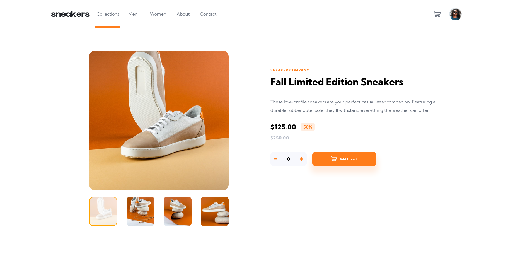

# Frontend Mentor - E-commerce product page solution

This is a solution to the [E-commerce product page challenge on Frontend Mentor](https://www.frontendmentor.io/challenges/ecommerce-product-page-UPsZ9MJp6). Frontend Mentor challenges help you improve your coding skills by building realistic projects.

## Table of contents

- [Overview](#overview)
  - [The challenge](#the-challenge)
  - [Screenshot](#screenshot)
  - [Links](#links)
- [My process](#my-process)
  - [Built with](#built-with)
  - [What I learned](#what-i-learned)
- [Author](#author)

## Overview

A clean and simple product page that has a cart component, as well as product image carousel.

### The challenge

Users should be able to:

- View the optimal layout for the site depending on their device's screen size
- See hover states for all interactive elements on the page
- Open a lightbox gallery by clicking on the large product image
- Switch the large product image by clicking on the small thumbnail images
- Add items to the cart
- View the cart and remove items from it

### Screenshot

### Links

- Solution URL: [Solution](https://www.frontendmentor.io/solutions/ecommerce-product-page-pJpgo4OsI)
- Live Site URL: [Live Site](https://chris-base.github.io/ecommerce-product-page/)

## My process

Created react app and started with creating components with different sections of app. Created layout for each section and styled each one. Added functionality with different parts for the user to interact with. Added flexability and responsivness for different device/screen sizes.

### Built with

- Semantic HTML5 markup
- CSS custom properties
- Flexbox
- CSS Grid
- Mobile-first workflow
- [React](https://reactjs.org/) - JS library

### What I learned

I learned about events and how you can change the DOM depending on user input.

## Author

- Website - [Chris base](https://github.com/chris-base)
- Frontend Mentor - [@chris-base](https://www.frontendmentor.io/profile/chris-base)
